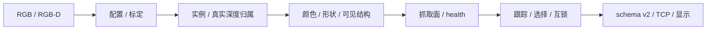

# 模块使用说明

更新：2026-10-02。模块、可见类／函数及直接导入测试由当前源码核对。名称用于定位，不承诺所有函数都是稳定外部API。

新用户先读[完整手册](双相机工程完整使用手册.md)；参数见[CLI索引](CLI命令与参数索引.md)，配置见[配置与版本](配置与模型版本.md)。

## 1. 按任务找到入口

| 任务 | 接口 | 教程 |
|---|---|---|
| RGB单件／场景 | predict-image／predict-scene | [单图](单图预测使用说明.md)／[场景](多物块场景预测使用说明.md) |
| 单RGB-D采集／平面／训练 | rgbd-capture-assistant／rgbd-calibrate／geometry-rgbd-train | [RGB-D](RGBD数据采集与训练.md) |
| 文件／应用审查 | rgbd-dataset-audit／rgbd-review | [审查](视觉审查流程.md) |
| 服务／互锁 | VisionService3D／MotionInterlock／serve | [服务](服务接口与部署.md) |
| 双机采集／标定 | dual_rgbd_side_capture.py／rgb_intrinsics_calibrate.py／dual_apriltag_calibrate.py | [采集](双视角形状与颜色数据采集完整教程.md)／[标定](三AprilTag双相机采集与标定程序.md) |
| 双机模型／空间 | DualViewFusion／SideGeometryModel／CrossViewTopologyModel／sparse_stereo | [融合](双视角几何识别与安全融合.md) |

## 2. 数据流与格式

RGBFrame只含RGB；RGBDFrame携带原深度、内参、比例和时间戳，通过depth_mm读取毫米。resize_rgbd_frame同步缩放RGB、深度和内参，不能手动只缩RGB。

单RGB-D为color.png／depth.npy／metadata.json；双机为primary-color.png／primary-depth.npy／side-color.png／metadata.json，只由配对入口消费。原图、校正颜色图、分割掩膜与几何验证图用途不同。



## 3. 主RGB-D离线集成

准备实际已有文件，不打开相机：

```python
from sorting_vision.config import load_config
from sorting_vision.camera import load_rgbd_frame
from sorting_vision.rgbd import RGBDCalibration
from sorting_vision.pipeline3d import VisionPipeline3D

config = load_config("config/d435if-initial.yaml")
calibration = RGBDCalibration.load("output/rgbd-calibration-20261002.json")
frame = load_rgbd_frame("data/rgbd-test/sample")
pipeline = VisionPipeline3D(config=config, calibration=calibration)
results = pipeline.process(frame)
print(pipeline.health())
print([item.to_dict() for item in results])
```

路径换成实际资料；匹配DepthGeometryModel通过shape_model传入。一次process不能验证稳定选目标；重复同一照片不等于现场时序验证。默认机械变换不代表实测。

## 4. 模块修改的检查

相机创建／读取／关闭保持同一资源所有者，异常也close。标定含平台、尺寸、比例和哈希。分类保留完整概率、拒识、特征契约。抓取依赖主真实深度；输出用to_dict。

分割、线段、面语义改变后重提特征并拟合匹配模型，实际看图；最终留出不能调模型／策略。文档校验不等于算法或现场验收。

## 5. 全部模块与测试

### [__init__.py](../../src/sorting_vision/__init__.py)

包标识；业务接口从具体模块导入

源码入口：无模块级公开类／函数，查看声明与调用方。

直接导入测试：未发现直接导入；还需核对流水线／集成覆盖。

### [apriltag_calibration.py](../../src/sorting_vision/apriltag_calibration.py)

三标签检测、姿态、双机／料盘求解和质量

源码入口：[`AprilTagObservation`](../../src/sorting_vision/apriltag_calibration.py:26)、[`validate_apriltag_ids`](../../src/sorting_vision/apriltag_calibration.py:42)、[`detect_apriltags`](../../src/sorting_vision/apriltag_calibration.py:71)、[`draw_apriltags`](../../src/sorting_vision/apriltag_calibration.py:119)、[`generate_three_tag_assets`](../../src/sorting_vision/apriltag_calibration.py:134)、[`tag_object_points`](../../src/sorting_vision/apriltag_calibration.py:240)、[`fixed_intrinsics_reprojection_rms`](../../src/sorting_vision/apriltag_calibration.py:288)、[`estimate_tray_frame_from_diagonal_tags`](../../src/sorting_vision/apriltag_calibration.py:321)、[`stereo_projection_diagnostics`](../../src/sorting_vision/apriltag_calibration.py:466)、[`calibrate_apriltag_pairs`](../../src/sorting_vision/apriltag_calibration.py:504)、[`free_tag_pose_signature`](../../src/sorting_vision/apriltag_calibration.py:724)、[`pose_is_diverse`](../../src/sorting_vision/apriltag_calibration.py:733)

直接导入测试：[test_apriltag_capture_programs.py](../../tests/test_apriltag_capture_programs.py)、[test_calibration_workflow.py](../../tests/test_calibration_workflow.py)

### [calibration.py](../../src/sorting_vision/calibration.py)

旧二维四点透视矫正，不能代替三维标定

源码入口：[`PerspectiveCalibration`](../../src/sorting_vision/calibration.py:14)

直接导入测试：[test_calibration.py](../../tests/test_calibration.py)、[test_calibration_workflow.py](../../tests/test_calibration_workflow.py)、[test_pipeline.py](../../tests/test_pipeline.py)、[test_rgb_development.py](../../tests/test_rgb_development.py)

### [calibration_capture.py](../../src/sorting_vision/calibration_capture.py)

标定停稳／清晰度检查、会话隔离、失败输出保护与通过备份

源码入口：[`prepare_calibration_session`](../../src/sorting_vision/calibration_capture.py:15)、[`write_calibration_image`](../../src/sorting_vision/calibration_capture.py:24)、[`CalibrationCaptureTracker`](../../src/sorting_vision/calibration_capture.py:29)、[`publish_calibration`](../../src/sorting_vision/calibration_capture.py:81)

直接导入测试：[test_calibration_workflow.py](../../tests/test_calibration_workflow.py)

### [camera.py](../../src/sorting_vision/camera.py)

UVC／RealSense采集、对齐、时间戳、帧文件读写和资源关闭

源码入口：[`RGBFrame`](../../src/sorting_vision/camera.py:20)、[`ColorSource`](../../src/sorting_vision/camera.py:32)、[`RGBDSource`](../../src/sorting_vision/camera.py:38)、[`SynchronizedFramePair`](../../src/sorting_vision/camera.py:45)、[`DualCameraSource`](../../src/sorting_vision/camera.py:84)、[`OpenCVCameraSource`](../../src/sorting_vision/camera.py:246)、[`ProcessOpenCVCameraSource`](../../src/sorting_vision/camera.py:424)、[`RealSenseSource`](../../src/sorting_vision/camera.py:572)、[`RealSenseColorSource`](../../src/sorting_vision/camera.py:711)、[`ThreadedRealSenseSource`](../../src/sorting_vision/camera.py:813)、[`RealSenseD435IFSource`](../../src/sorting_vision/camera.py:934)、[`RealSenseD415Source`](../../src/sorting_vision/camera.py:943)、[`save_rgbd_frame`](../../src/sorting_vision/camera.py:952)、[`load_rgbd_frame`](../../src/sorting_vision/camera.py:970)、[`FileRGBDSource`](../../src/sorting_vision/camera.py:988)

直接导入测试：[test_apriltag_capture_programs.py](../../tests/test_apriltag_capture_programs.py)、[test_calibration_workflow.py](../../tests/test_calibration_workflow.py)、[test_camera_server.py](../../tests/test_camera_server.py)、[test_dual_view.py](../../tests/test_dual_view.py)、[test_live_camera.py](../../tests/test_live_camera.py)、[test_motion_interlock.py](../../tests/test_motion_interlock.py)、[test_rgb_development.py](../../tests/test_rgb_development.py)

### [capture_assistant.py](../../src/sorting_vision/capture_assistant.py)

单RealSense逐类计数、稳定质量与渲染

源码入口：[`capture_label_index`](../../src/sorting_vision/capture_assistant.py:22)、[`load_batch_counts`](../../src/sorting_vision/capture_assistant.py:32)、[`CaptureAssistantState`](../../src/sorting_vision/capture_assistant.py:55)、[`CaptureQualityTracker`](../../src/sorting_vision/capture_assistant.py:100)、[`render_capture_assistant`](../../src/sorting_vision/capture_assistant.py:168)

直接导入测试：[test_apriltag_capture_programs.py](../../tests/test_apriltag_capture_programs.py)、[test_capture_assistant.py](../../tests/test_capture_assistant.py)、[test_multi_capture.py](../../tests/test_multi_capture.py)

### [classification.py](../../src/sorting_vision/classification.py)

颜色、基础轮廓规则和混合RGB形状接口

源码入口：[`LabelPrediction`](../../src/sorting_vision/classification.py:13)、[`LabColorClassifier`](../../src/sorting_vision/classification.py:31)、[`GeometricShapeClassifier`](../../src/sorting_vision/classification.py:81)、[`HybridShapeClassifier`](../../src/sorting_vision/classification.py:135)

直接导入测试：[test_classification.py](../../tests/test_classification.py)、[test_geometry_models.py](../../tests/test_geometry_models.py)、[test_visual_v7.py](../../tests/test_visual_v7.py)、[test_visual_v8.py](../../tests/test_visual_v8.py)

### [classification3d.py](../../src/sorting_vision/classification3d.py)

真实点云规则与主视混合模型分类

源码入口：[`ShapeModel3D`](../../src/sorting_vision/classification3d.py:13)、[`PrimitiveShapeClassifier3D`](../../src/sorting_vision/classification3d.py:58)、[`HybridShapeClassifier3D`](../../src/sorting_vision/classification3d.py:119)

直接导入测试：[test_geometry_models.py](../../tests/test_geometry_models.py)

### [cli.py](../../src/sorting_vision/cli.py)

CLI参数、配置、资源创建与保存；私有_run函数不作公共API

源码入口：[`build_parser`](../../src/sorting_vision/cli.py:1902)、[`main`](../../src/sorting_vision/cli.py:2630)

直接导入测试：[test_pipeline3d.py](../../tests/test_pipeline3d.py)、[test_scene_image.py](../../tests/test_scene_image.py)、[test_single_image.py](../../tests/test_single_image.py)

### [color_v7.py](../../src/sorting_vision/color_v7.py)

两路固定颜色校正、稳健原型、缓存与拒识

源码入口：[`canonical_color`](../../src/sorting_vision/color_v7.py:17)、[`ColorFrameContext`](../../src/sorting_vision/color_v7.py:22)、[`neutral_correction`](../../src/sorting_vision/color_v7.py:40)、[`recover_components`](../../src/sorting_vision/color_v7.py:63)、[`color_vector`](../../src/sorting_vision/color_v7.py:127)、[`CameraColorProfile`](../../src/sorting_vision/color_v7.py:141)

直接导入测试：[test_visual_v7.py](../../tests/test_visual_v7.py)

### [config.py](../../src/sorting_vision/config.py)

YAML继承、类型化参数、模型与视觉契约配置

源码入口：[`TrayConfig`](../../src/sorting_vision/config.py:11)、[`SegmentationConfig`](../../src/sorting_vision/config.py:19)、[`ClassificationConfig`](../../src/sorting_vision/config.py:32)、[`SelectionConfig`](../../src/sorting_vision/config.py:43)、[`RGBDConfig`](../../src/sorting_vision/config.py:49)、[`GraspConfig`](../../src/sorting_vision/config.py:75)、[`NetworkConfig`](../../src/sorting_vision/config.py:87)、[`CameraConfig`](../../src/sorting_vision/config.py:93)、[`DualViewConfig`](../../src/sorting_vision/config.py:109)、[`MotionInterlockConfig`](../../src/sorting_vision/config.py:178)、[`VisionConfig`](../../src/sorting_vision/config.py:187)、[`load_config`](../../src/sorting_vision/config.py:228)

直接导入测试：[test_apriltag_capture_programs.py](../../tests/test_apriltag_capture_programs.py)、[test_classification.py](../../tests/test_classification.py)、[test_dual_view.py](../../tests/test_dual_view.py)、[test_evaluation.py](../../tests/test_evaluation.py)、[test_evaluation3d.py](../../tests/test_evaluation3d.py)、[test_geometry3d.py](../../tests/test_geometry3d.py)、[test_geometry_models.py](../../tests/test_geometry_models.py)、[test_grasp3d.py](../../tests/test_grasp3d.py)、[test_hsv_instances.py](../../tests/test_hsv_instances.py)、[test_live_camera.py](../../tests/test_live_camera.py)、[test_motion_interlock.py](../../tests/test_motion_interlock.py)、[test_pipeline.py](../../tests/test_pipeline.py)、[test_rgb_development.py](../../tests/test_rgb_development.py)、[test_rgb_instance_contract.py](../../tests/test_rgb_instance_contract.py)、[test_rgb_overhang.py](../../tests/test_rgb_overhang.py)、[test_segmentation.py](../../tests/test_segmentation.py)、[test_side_complete_components.py](../../tests/test_side_complete_components.py)、[test_sparse_stereo.py](../../tests/test_sparse_stereo.py)、[test_visual_v7.py](../../tests/test_visual_v7.py)、[test_visual_v8.py](../../tests/test_visual_v8.py)

### [cross_view_topology.py](../../src/sorting_vision/cross_view_topology.py)

主点云与侧线支持的联合特征／模型

源码入口：[`CrossViewFeatureResult`](../../src/sorting_vision/cross_view_topology.py:40)、[`extract_cross_view_features`](../../src/sorting_vision/cross_view_topology.py:181)、[`CrossViewTopologyModel`](../../src/sorting_vision/cross_view_topology.py:339)、[`annotate_cross_view_topology`](../../src/sorting_vision/cross_view_topology.py:579)

直接导入测试：[test_cross_view_topology.py](../../tests/test_cross_view_topology.py)

### [dual_capture_app.py](../../src/sorting_vision/dual_capture_app.py)

双机三画面质量、批次计数、metadata和清单

源码入口：[`load_dual_batch_counts`](../../src/sorting_vision/dual_capture_app.py:17)、[`DualCaptureQualityTracker`](../../src/sorting_vision/dual_capture_app.py:47)、[`render_dual_capture_assistant`](../../src/sorting_vision/dual_capture_app.py:135)、[`save_dual_capture_sample`](../../src/sorting_vision/dual_capture_app.py:211)

直接导入测试：[test_apriltag_capture_programs.py](../../tests/test_apriltag_capture_programs.py)

### [dual_validation.py](../../src/sorting_vision/dual_validation.py)

配对联系表、逐样本审查写回、校准与推广门

源码入口：[`build_dual_contact_sheets`](../../src/sorting_vision/dual_validation.py:47)、[`apply_dual_review_records`](../../src/sorting_vision/dual_validation.py:151)、[`evaluate_promotion`](../../src/sorting_vision/dual_validation.py:266)、[`fit_probability_temperatures`](../../src/sorting_vision/dual_validation.py:370)、[`fit_fusion_policy`](../../src/sorting_vision/dual_validation.py:452)

直接导入测试：[test_dual_view.py](../../tests/test_dual_view.py)、[test_shape_registry_and_side.py](../../tests/test_shape_registry_and_side.py)

### [dual_view.py](../../src/sorting_vision/dual_view.py)

标定投影、侧归属、遮挡质量、受约束融合与诊断

源码入口：[`FusionState`](../../src/sorting_vision/dual_view.py:23)、[`DualCalibrationQualityLimits`](../../src/sorting_vision/dual_view.py:34)、[`DualCalibrationMetrics`](../../src/sorting_vision/dual_view.py:78)、[`DualViewCalibration`](../../src/sorting_vision/dual_view.py:131)、[`ProjectedROI`](../../src/sorting_vision/dual_view.py:294)、[`SideEvidence`](../../src/sorting_vision/dual_view.py:305)、[`SideColorSegmentation`](../../src/sorting_vision/dual_view.py:321)、[`associate_side_color_components`](../../src/sorting_vision/dual_view.py:329)、[`measure_side_color_segmentation`](../../src/sorting_vision/dual_view.py:406)、[`calibrated_probabilities`](../../src/sorting_vision/dual_view.py:433)、[`normalize_scores`](../../src/sorting_vision/dual_view.py:454)、[`temperature_scale_scores`](../../src/sorting_vision/dual_view.py:462)、[`build_object_envelope`](../../src/sorting_vision/dual_view.py:472)、[`projected_roi`](../../src/sorting_vision/dual_view.py:489)、[`roi_overlap_ratio`](../../src/sorting_vision/dual_view.py:530)、[`DualViewFusion`](../../src/sorting_vision/dual_view.py:606)、[`save_synchronized_pair`](../../src/sorting_vision/dual_view.py:1332)、[`load_synchronized_pair`](../../src/sorting_vision/dual_view.py:1374)、[`calibrate_charuco_pairs`](../../src/sorting_vision/dual_view.py:1415)

直接导入测试：[test_cross_view_topology.py](../../tests/test_cross_view_topology.py)、[test_dual_view.py](../../tests/test_dual_view.py)、[test_hsv_instances.py](../../tests/test_hsv_instances.py)、[test_side_complete_components.py](../../tests/test_side_complete_components.py)、[test_sparse_stereo.py](../../tests/test_sparse_stereo.py)、[test_visual_v7.py](../../tests/test_visual_v7.py)、[test_visual_v8.py](../../tests/test_visual_v8.py)

### [evaluation.py](../../src/sorting_vision/evaluation.py)

RGB合成／离线评价，不代替现场测量

源码入口：[`BenchmarkReport`](../../src/sorting_vision/evaluation.py:26)、[`run_synthetic_benchmark`](../../src/sorting_vision/evaluation.py:52)

直接导入测试：[test_evaluation.py](../../tests/test_evaluation.py)、[test_evaluation3d.py](../../tests/test_evaluation3d.py)

### [evaluation3d.py](../../src/sorting_vision/evaluation3d.py)

RGB-D合成基准与评价

源码入口：[`BenchmarkReport3D`](../../src/sorting_vision/evaluation3d.py:25)、[`run_rgbd_benchmark`](../../src/sorting_vision/evaluation3d.py:50)

直接导入测试：[test_evaluation3d.py](../../tests/test_evaluation3d.py)

### [extensions.py](../../src/sorting_vision/extensions.py)

分割／分类扩展协议，保留安全条件

源码入口：[`VisionExtension`](../../src/sorting_vision/extensions.py:9)、[`QRCodeExtension`](../../src/sorting_vision/extensions.py:15)、[`CallableExtension`](../../src/sorting_vision/extensions.py:30)

直接导入测试：未发现直接导入；还需核对流水线／集成覆盖。

### [face_topology3d.py](../../src/sorting_vision/face_topology3d.py)

真实深度局部平面、面邻接和可见拓扑

源码入口：[`PlanarFace3D`](../../src/sorting_vision/face_topology3d.py:13)、[`FusedEdge3D`](../../src/sorting_vision/face_topology3d.py:22)、[`FaceTopology3D`](../../src/sorting_vision/face_topology3d.py:40)、[`extract_face_topology`](../../src/sorting_vision/face_topology3d.py:503)、[`face_topology_features`](../../src/sorting_vision/face_topology3d.py:628)、[`fused_edge_features`](../../src/sorting_vision/face_topology3d.py:676)

直接导入测试：[test_face_topology3d.py](../../tests/test_face_topology3d.py)、[test_visual_v7.py](../../tests/test_visual_v7.py)

### [fusion_policy.py](../../src/sorting_vision/fusion_policy.py)

温度、完整概率Top-2融合、接受门和持久化

源码入口：[`FusionPolicy`](../../src/sorting_vision/fusion_policy.py:28)、[`top2_fusion_features`](../../src/sorting_vision/fusion_policy.py:102)、[`fuse_top2_scores`](../../src/sorting_vision/fusion_policy.py:123)、[`accepted_fusion_scores`](../../src/sorting_vision/fusion_policy.py:195)、[`resolve_fusion_backend`](../../src/sorting_vision/fusion_policy.py:245)

直接导入测试：[test_shape_registry_and_side.py](../../tests/test_shape_registry_and_side.py)、[test_visual_v7.py](../../tests/test_visual_v7.py)

### [geometry3d.py](../../src/sorting_vision/geometry3d.py)

工作区、深度前景、RGB-D实例、点云与几何摘要

源码入口：[`DepthSegmentedObject`](../../src/sorting_vision/geometry3d.py:13)、[`height_map_from_plane`](../../src/sorting_vision/geometry3d.py:29)、[`valid_depth_mask`](../../src/sorting_vision/geometry3d.py:46)、[`estimate_plane_shift_mm`](../../src/sorting_vision/geometry3d.py:55)、[`segment_depth_objects`](../../src/sorting_vision/geometry3d.py:270)、[`depth_footprint_in_tray`](../../src/sorting_vision/geometry3d.py:334)、[`segment_hsv_objects`](../../src/sorting_vision/geometry3d.py:426)、[`object_point_cloud`](../../src/sorting_vision/geometry3d.py:504)、[`local_surface_plane`](../../src/sorting_vision/geometry3d.py:513)

直接导入测试：[test_geometry3d.py](../../tests/test_geometry3d.py)、[test_grasp3d.py](../../tests/test_grasp3d.py)、[test_hsv_instances.py](../../tests/test_hsv_instances.py)、[test_rgb_overhang.py](../../tests/test_rgb_overhang.py)、[test_side_complete_components.py](../../tests/test_side_complete_components.py)

### [geometry_cnn.py](../../src/sorting_vision/geometry_cnn.py)

可选RGB CNN训练、OpenVINO推理与导出

源码入口：[`cnn_input_tensor`](../../src/sorting_vision/geometry_cnn.py:94)、[`OpenVINOGeometryModel`](../../src/sorting_vision/geometry_cnn.py:107)、[`load_geometry_shape_model`](../../src/sorting_vision/geometry_cnn.py:241)、[`load_cnn_training_samples`](../../src/sorting_vision/geometry_cnn.py:434)、[`train_geometry_cnn`](../../src/sorting_vision/geometry_cnn.py:456)、[`export_geometry_cnn`](../../src/sorting_vision/geometry_cnn.py:669)、[`evaluate_geometry_backend`](../../src/sorting_vision/geometry_cnn.py:771)、[`export_geometry_backend_results`](../../src/sorting_vision/geometry_cnn.py:807)、[`benchmark_geometry_backend`](../../src/sorting_vision/geometry_cnn.py:927)

直接导入测试：[test_geometry_models.py](../../tests/test_geometry_models.py)

### [geometry_edge_audit.py](../../src/sorting_vision/geometry_edge_audit.py)

RGB棱线审查图、特征与对照

源码入口：[`audit_geometry_edges`](../../src/sorting_vision/geometry_edge_audit.py:20)

直接导入测试：[test_geometry_edges.py](../../tests/test_geometry_edges.py)

### [geometry_edges.py](../../src/sorting_vision/geometry_edges.py)

RGB线、内部结构与拓扑；候选不是物理真值

源码入口：[`EdgeLine`](../../src/sorting_vision/geometry_edges.py:39)、[`EdgeJunction`](../../src/sorting_vision/geometry_edges.py:54)、[`EdgeTopology`](../../src/sorting_vision/geometry_edges.py:62)、[`extract_edge_topology`](../../src/sorting_vision/geometry_edges.py:559)、[`edge_topology_vector`](../../src/sorting_vision/geometry_edges.py:717)、[`render_edge_lines`](../../src/sorting_vision/geometry_edges.py:780)

直接导入测试：[test_geometry_edges.py](../../tests/test_geometry_edges.py)、[test_visual_v7.py](../../tests/test_visual_v7.py)

### [geometry_models.py](../../src/sorting_vision/geometry_models.py)

RGB模型训练／加载、距离／树模型和接受判断

源码入口：[`GeometryCandidate`](../../src/sorting_vision/geometry_models.py:10)、[`GeometryPrediction`](../../src/sorting_vision/geometry_models.py:16)、[`GeometryShapeModel`](../../src/sorting_vision/geometry_models.py:31)、[`EnsembleGeometryModel`](../../src/sorting_vision/geometry_models.py:45)

直接导入测试：[test_geometry_models.py](../../tests/test_geometry_models.py)、[test_pipeline.py](../../tests/test_pipeline.py)

### [geometry_rgb.py](../../src/sorting_vision/geometry_rgb.py)

RGB类别数据加载、掩膜／裁剪和基础特征

源码入口：[`GeometrySample`](../../src/sorting_vision/geometry_rgb.py:57)、[`GeometryPreprocessed`](../../src/sorting_vision/geometry_rgb.py:66)、[`load_geometry_samples`](../../src/sorting_vision/geometry_rgb.py:81)、[`preprocess_geometry_object`](../../src/sorting_vision/geometry_rgb.py:131)、[`geometry_feature_groups`](../../src/sorting_vision/geometry_rgb.py:285)、[`extract_geometry_features`](../../src/sorting_vision/geometry_rgb.py:333)、[`GeometryRGBModel`](../../src/sorting_vision/geometry_rgb.py:370)、[`audit_geometry_dataset`](../../src/sorting_vision/geometry_rgb.py:850)、[`train_geometry_model`](../../src/sorting_vision/geometry_rgb.py:875)、[`evaluate_geometry_holdout`](../../src/sorting_vision/geometry_rgb.py:924)、[`evaluate_geometry_model`](../../src/sorting_vision/geometry_rgb.py:988)、[`compare_geometry_models`](../../src/sorting_vision/geometry_rgb.py:1051)、[`export_geometry_results`](../../src/sorting_vision/geometry_rgb.py:1097)

直接导入测试：[test_geometry_edges.py](../../tests/test_geometry_edges.py)、[test_geometry_models.py](../../tests/test_geometry_models.py)、[test_geometry_rgb.py](../../tests/test_geometry_rgb.py)、[test_geometry_structure.py](../../tests/test_geometry_structure.py)、[test_rgb_instance_contract.py](../../tests/test_rgb_instance_contract.py)、[test_rgb_overhang.py](../../tests/test_rgb_overhang.py)、[test_rgbd_dataset.py](../../tests/test_rgbd_dataset.py)、[test_scene_image.py](../../tests/test_scene_image.py)、[test_single_image.py](../../tests/test_single_image.py)

### [geometry_rgbd_model.py](../../src/sorting_vision/geometry_rgbd_model.py)

主RGB-D特征、训练／拒识及输入来源契约

源码入口：[`extract_rgbd_geometry_features`](../../src/sorting_vision/geometry_rgbd_model.py:56)、[`DepthGeometryModel`](../../src/sorting_vision/geometry_rgbd_model.py:131)、[`detect_tray_roi_mask`](../../src/sorting_vision/geometry_rgbd_model.py:435)、[`constrain_tray_roi`](../../src/sorting_vision/geometry_rgbd_model.py:553)、[`detect_rgb_object_support`](../../src/sorting_vision/geometry_rgbd_model.py:570)、[`train_rgbd_geometry_model`](../../src/sorting_vision/geometry_rgbd_model.py:626)

直接导入测试：[test_geometry_models.py](../../tests/test_geometry_models.py)、[test_rgb_instance_contract.py](../../tests/test_rgb_instance_contract.py)、[test_rgb_overhang.py](../../tests/test_rgb_overhang.py)、[test_rgbd_dataset.py](../../tests/test_rgbd_dataset.py)

### [geometry_structure.py](../../src/sorting_vision/geometry_structure.py)

保守轮廓线与顶点；独立结构特征语义

源码入口：[`StructuralLine`](../../src/sorting_vision/geometry_structure.py:22)、[`StructuralVertex`](../../src/sorting_vision/geometry_structure.py:36)、[`StructuralContour`](../../src/sorting_vision/geometry_structure.py:45)、[`extract_structural_contour`](../../src/sorting_vision/geometry_structure.py:445)、[`render_structural_contour`](../../src/sorting_vision/geometry_structure.py:545)、[`structural_contour_vector`](../../src/sorting_vision/geometry_structure.py:561)

直接导入测试：[test_geometry_structure.py](../../tests/test_geometry_structure.py)

### [geometry_structure_audit.py](../../src/sorting_vision/geometry_structure_audit.py)

单物块／场景结构审查和联系表

源码入口：[`audit_geometry_structures`](../../src/sorting_vision/geometry_structure_audit.py:50)、[`audit_geometry_scene_structures`](../../src/sorting_vision/geometry_structure_audit.py:119)

直接导入测试：[test_geometry_structure.py](../../tests/test_geometry_structure.py)

### [grasp3d.py](../../src/sorting_vision/grasp3d.py)

吸附平面、平整度、真实深度、边缘余量与位姿

源码入口：[`GraspCandidate`](../../src/sorting_vision/grasp3d.py:16)、[`rotation_matrix_to_quaternion`](../../src/sorting_vision/grasp3d.py:23)、[`find_suction_grasp`](../../src/sorting_vision/grasp3d.py:91)

直接导入测试：[test_grasp3d.py](../../tests/test_grasp3d.py)

### [group_holdout.py](../../src/sorting_vision/group_holdout.py)

确定性分组留出与来源ID，隔离训练／校准／测试

源码入口：[`GroupHoldoutSplit`](../../src/sorting_vision/group_holdout.py:14)、[`deterministic_group_holdout`](../../src/sorting_vision/group_holdout.py:22)

直接导入测试：[test_group_holdout.py](../../tests/test_group_holdout.py)

### [interlock.py](../../src/sorting_vision/interlock.py)

运动、等待稳定、可计算互锁；双机工程含双视角互锁

源码入口：[`RunState`](../../src/sorting_vision/interlock.py:13)、[`MotionInterlock`](../../src/sorting_vision/interlock.py:19)、[`DualMotionInterlock`](../../src/sorting_vision/interlock.py:105)

直接导入测试：[test_motion_interlock.py](../../tests/test_motion_interlock.py)

### [intrinsic_calibration.py](../../src/sorting_vision/intrinsic_calibration.py)

RGB棋盘内参／畸变、姿态质量与SDK投影约定

源码入口：[`SDKProjectionCalibration`](../../src/sorting_vision/intrinsic_calibration.py:18)、[`load_projection_calibration`](../../src/sorting_vision/intrinsic_calibration.py:45)、[`CameraCalibration`](../../src/sorting_vision/intrinsic_calibration.py:62)、[`checkerboard_object_points`](../../src/sorting_vision/intrinsic_calibration.py:194)、[`generate_checkerboard_asset`](../../src/sorting_vision/intrinsic_calibration.py:210)、[`checkerboard_points_from_image`](../../src/sorting_vision/intrinsic_calibration.py:295)、[`calibration_view_signature`](../../src/sorting_vision/intrinsic_calibration.py:341)、[`calibrate_camera_intrinsics`](../../src/sorting_vision/intrinsic_calibration.py:352)

直接导入测试：[test_calibration_workflow.py](../../tests/test_calibration_workflow.py)、[test_intrinsic_calibration.py](../../tests/test_intrinsic_calibration.py)、[test_sdk_projection_calibration.py](../../tests/test_sdk_projection_calibration.py)

### [joint_topology.py](../../src/sorting_vision/joint_topology.py)

部分可见点线面证据图，非完整网格

源码入口：[`build_joint_topology`](../../src/sorting_vision/joint_topology.py:38)

直接导入测试：[test_joint_topology.py](../../tests/test_joint_topology.py)

### [multi_capture.py](../../src/sorting_vision/multi_capture.py)

单RGB-D场景组成、断点计数与质量

源码入口：[`parse_scene_composition`](../../src/sorting_vision/multi_capture.py:23)、[`composition_summary`](../../src/sorting_vision/multi_capture.py:49)、[`load_scene_counts`](../../src/sorting_vision/multi_capture.py:70)、[`validate_scene_composition`](../../src/sorting_vision/multi_capture.py:92)、[`resolve_scene_index`](../../src/sorting_vision/multi_capture.py:122)、[`MultiCaptureState`](../../src/sorting_vision/multi_capture.py:134)、[`save_multi_object_sample`](../../src/sorting_vision/multi_capture.py:174)、[`render_multi_capture`](../../src/sorting_vision/multi_capture.py:233)

直接导入测试：[test_multi_capture.py](../../tests/test_multi_capture.py)

### [pipeline.py](../../src/sorting_vision/pipeline.py)

旧RGB二维分割、分类、中心／角度、跟踪和标注

源码入口：[`VisionPipeline`](../../src/sorting_vision/pipeline.py:18)

直接导入测试：[test_camera_server.py](../../tests/test_camera_server.py)、[test_pipeline.py](../../tests/test_pipeline.py)、[test_pipeline3d.py](../../tests/test_pipeline3d.py)、[test_rgb_development.py](../../tests/test_rgb_development.py)、[test_rgb_instance_contract.py](../../tests/test_rgb_instance_contract.py)、[test_rgb_overhang.py](../../tests/test_rgb_overhang.py)、[test_visual_v7.py](../../tests/test_visual_v7.py)、[test_visual_v8.py](../../tests/test_visual_v8.py)

### [pipeline3d.py](../../src/sorting_vision/pipeline3d.py)

RGB-D总流水线、health、实例、特征、抓取与选择

源码入口：[`VisionPipeline3D`](../../src/sorting_vision/pipeline3d.py:42)

直接导入测试：[test_camera_server.py](../../tests/test_camera_server.py)、[test_pipeline3d.py](../../tests/test_pipeline3d.py)、[test_rgb_instance_contract.py](../../tests/test_rgb_instance_contract.py)、[test_rgb_overhang.py](../../tests/test_rgb_overhang.py)、[test_visual_v7.py](../../tests/test_visual_v7.py)、[test_visual_v8.py](../../tests/test_visual_v8.py)

### [pose.py](../../src/sorting_vision/pose.py)

旧二维中心与角度，非三维机械位姿

源码入口：[`safe_grasp_point`](../../src/sorting_vision/pose.py:15)、[`principal_angle_deg`](../../src/sorting_vision/pose.py:21)、[`estimate_pose`](../../src/sorting_vision/pose.py:38)、[`masked_crop`](../../src/sorting_vision/pose.py:53)

直接导入测试：未发现直接导入；还需核对流水线／集成覆盖。

### [rgb_development.py](../../src/sorting_vision/rgb_development.py)

RGB-only接口适配；强制DEPTH_REQUIRED和不可选择

源码入口：[`RGBDevelopmentPipeline`](../../src/sorting_vision/rgb_development.py:9)

直接导入测试：[test_rgb_development.py](../../tests/test_rgb_development.py)

### [rgb_instance.py](../../src/sorting_vision/rgb_instance.py)

完整RGB轮廓及真实深度归属；不补造孔洞

源码入口：[`recover_rgb_masks`](../../src/sorting_vision/rgb_instance.py:8)

直接导入测试：[test_rgb_instance.py](../../tests/test_rgb_instance.py)

### [rgbd.py](../../src/sorting_vision/rgbd.py)

内参、原深度转毫米、点云、平面、变换与同步缩放

源码入口：[`CameraIntrinsics`](../../src/sorting_vision/rgbd.py:12)、[`Plane`](../../src/sorting_vision/rgbd.py:40)、[`RGBDCalibration`](../../src/sorting_vision/rgbd.py:81)、[`RGBDFrame`](../../src/sorting_vision/rgbd.py:148)、[`resize_rgbd_frame`](../../src/sorting_vision/rgbd.py:187)、[`backproject_pixels`](../../src/sorting_vision/rgbd.py:212)、[`project_points`](../../src/sorting_vision/rgbd.py:226)、[`depth_to_points`](../../src/sorting_vision/rgbd.py:236)、[`fit_plane_svd`](../../src/sorting_vision/rgbd.py:254)、[`fit_plane_ransac`](../../src/sorting_vision/rgbd.py:267)

直接导入测试：[test_apriltag_capture_programs.py](../../tests/test_apriltag_capture_programs.py)、[test_calibration_workflow.py](../../tests/test_calibration_workflow.py)、[test_capture_assistant.py](../../tests/test_capture_assistant.py)、[test_cross_view_topology.py](../../tests/test_cross_view_topology.py)、[test_dual_view.py](../../tests/test_dual_view.py)、[test_face_topology3d.py](../../tests/test_face_topology3d.py)、[test_geometry3d.py](../../tests/test_geometry3d.py)、[test_geometry_models.py](../../tests/test_geometry_models.py)、[test_grasp3d.py](../../tests/test_grasp3d.py)、[test_hsv_instances.py](../../tests/test_hsv_instances.py)、[test_intrinsic_calibration.py](../../tests/test_intrinsic_calibration.py)、[test_live_camera.py](../../tests/test_live_camera.py)、[test_multi_capture.py](../../tests/test_multi_capture.py)、[test_native_calibration_debug.py](../../tests/test_native_calibration_debug.py)、[test_pipeline3d.py](../../tests/test_pipeline3d.py)、[test_rgb_instance_contract.py](../../tests/test_rgb_instance_contract.py)、[test_rgb_overhang.py](../../tests/test_rgb_overhang.py)、[test_rgbd.py](../../tests/test_rgbd.py)、[test_rgbd_dataset.py](../../tests/test_rgbd_dataset.py)、[test_rgbd_review.py](../../tests/test_rgbd_review.py)、[test_sdk_projection_calibration.py](../../tests/test_sdk_projection_calibration.py)、[test_side_complete_components.py](../../tests/test_side_complete_components.py)、[test_sparse_stereo.py](../../tests/test_sparse_stereo.py)、[test_visual_v7.py](../../tests/test_visual_v7.py)、[test_visual_v8.py](../../tests/test_visual_v8.py)

### [rgbd_dataset.py](../../src/sorting_vision/rgbd_dataset.py)

单RGB-D标签、清单、保存与数据审计

源码入口：[`normalize_rgbd_label`](../../src/sorting_vision/rgbd_dataset.py:32)、[`depth_preview`](../../src/sorting_vision/rgbd_dataset.py:46)、[`save_rgbd_dataset_sample`](../../src/sorting_vision/rgbd_dataset.py:70)、[`load_rgbd_dataset_entries`](../../src/sorting_vision/rgbd_dataset.py:132)、[`audit_rgbd_dataset`](../../src/sorting_vision/rgbd_dataset.py:150)

直接导入测试：[test_rgbd_dataset.py](../../tests/test_rgbd_dataset.py)

### [rgbd_edge_audit.py](../../src/sorting_vision/rgbd_edge_audit.py)

RGB／深度内部棱线支持审计，孔洞不当棱

源码入口：[`render_fused_edge_audit`](../../src/sorting_vision/rgbd_edge_audit.py:36)、[`audit_rgbd_edges`](../../src/sorting_vision/rgbd_edge_audit.py:90)

直接导入测试：[test_face_topology3d.py](../../tests/test_face_topology3d.py)

### [rgbd_review.py](../../src/sorting_vision/rgbd_review.py)

已回放RGB-D结果联系表，非原始数据训练器

源码入口：[`build_rgbd_review`](../../src/sorting_vision/rgbd_review.py:76)

直接导入测试：[test_rgbd_review.py](../../tests/test_rgbd_review.py)

### [ridge_v7.py](../../src/sorting_vision/ridge_v7.py)

原图亮度候选、图像支持、拒绝原因与分层验证

源码入口：[`RidgeObservation`](../../src/sorting_vision/ridge_v7.py:16)、[`combine_recall_candidates`](../../src/sorting_vision/ridge_v7.py:25)、[`extract_ridges`](../../src/sorting_vision/ridge_v7.py:100)、[`extract_topology`](../../src/sorting_vision/ridge_v7.py:226)

直接导入测试：[test_visual_v7.py](../../tests/test_visual_v7.py)、[test_visual_v8.py](../../tests/test_visual_v8.py)

### [scene_image.py](../../src/sorting_vision/scene_image.py)

多分离对象RGB预测、逐对象资料

源码入口：[`SceneObjectResult`](../../src/sorting_vision/scene_image.py:19)、[`SceneImageResult`](../../src/sorting_vision/scene_image.py:40)、[`GeometryScenePredictor`](../../src/sorting_vision/scene_image.py:80)、[`save_scene_image_result`](../../src/sorting_vision/scene_image.py:277)

直接导入测试：[test_scene_image.py](../../tests/test_scene_image.py)

### [segmentation.py](../../src/sorting_vision/segmentation.py)

二维前景、连通域与分水岭；接触实例需独立证据

源码入口：[`InstanceSegmenter`](../../src/sorting_vision/segmentation.py:12)、[`foreground_mask`](../../src/sorting_vision/segmentation.py:18)、[`segment_objects`](../../src/sorting_vision/segmentation.py:104)

直接导入测试：[test_segmentation.py](../../tests/test_segmentation.py)

### [server.py](../../src/sorting_vision/server.py)

逐行JSON/TCP、源错误和服务状态；不发机器人运动

源码入口：[`VisionService3D`](../../src/sorting_vision/server.py:21)、[`serve_json_tcp`](../../src/sorting_vision/server.py:206)

直接导入测试：[test_camera_server.py](../../tests/test_camera_server.py)、[test_motion_interlock.py](../../tests/test_motion_interlock.py)

### [shape_registry.py](../../src/sorting_vision/shape_registry.py)

形状类别、别名、几何族、顺序与哈希

源码入口：[`ShapeClass`](../../src/sorting_vision/shape_registry.py:13)、[`ShapeRegistry`](../../src/sorting_vision/shape_registry.py:41)、[`default_registry_path`](../../src/sorting_vision/shape_registry.py:128)、[`load_shape_registry`](../../src/sorting_vision/shape_registry.py:132)

直接导入测试：[test_cross_view_topology.py](../../tests/test_cross_view_topology.py)、[test_rgb_instance_contract.py](../../tests/test_rgb_instance_contract.py)、[test_shape_registry_and_side.py](../../tests/test_shape_registry_and_side.py)、[test_visual_v7.py](../../tests/test_visual_v7.py)

### [side_cnn.py](../../src/sorting_vision/side_cnn.py)

可选侧CNN、后端导出和独立接受校准

源码入口：[`train_side_cnn`](../../src/sorting_vision/side_cnn.py:80)、[`export_side_cnn`](../../src/sorting_vision/side_cnn.py:139)、[`build_tensorrt_engine`](../../src/sorting_vision/side_cnn.py:212)、[`SideCNNModel`](../../src/sorting_vision/side_cnn.py:231)、[`compare_side_cnn_backends`](../../src/sorting_vision/side_cnn.py:316)、[`calibrate_side_cnn_acceptance`](../../src/sorting_vision/side_cnn.py:393)

直接导入测试：[test_shape_registry_and_side.py](../../tests/test_shape_registry_and_side.py)

### [side_geometry.py](../../src/sorting_vision/side_geometry.py)

侧掩膜与特征、KNN／RTrees、split隔离和校准

源码入口：[`SideFeatureResult`](../../src/sorting_vision/side_geometry.py:24)、[`SideTrainingSample`](../../src/sorting_vision/side_geometry.py:34)、[`extract_side_features`](../../src/sorting_vision/side_geometry.py:187)、[`side_foreground_mask`](../../src/sorting_vision/side_geometry.py:277)、[`load_side_training_samples`](../../src/sorting_vision/side_geometry.py:367)、[`audit_side_dataset`](../../src/sorting_vision/side_geometry.py:421)、[`calibrate_side_acceptance`](../../src/sorting_vision/side_geometry.py:513)、[`SideGeometryModel`](../../src/sorting_vision/side_geometry.py:597)

直接导入测试：[test_rgb_instance_contract.py](../../tests/test_rgb_instance_contract.py)、[test_shape_registry_and_side.py](../../tests/test_shape_registry_and_side.py)、[test_visual_v7.py](../../tests/test_visual_v7.py)

### [single_image.py](../../src/sorting_vision/single_image.py)

单件RGB预测、诊断及图像输出

源码入口：[`SingleImageResult`](../../src/sorting_vision/single_image.py:35)、[`GeometryImagePredictor`](../../src/sorting_vision/single_image.py:71)、[`save_single_image_result`](../../src/sorting_vision/single_image.py:195)

直接导入测试：[test_single_image.py](../../tests/test_single_image.py)

### [sparse_stereo.py](../../src/sorting_vision/sparse_stereo.py)

原生角点、唯一对应、三角化、质量门和回退细化

源码入口：[`SparseStereoLimits`](../../src/sorting_vision/sparse_stereo.py:14)、[`camera_matrix`](../../src/sorting_vision/sparse_stereo.py:30)、[`camera_poses`](../../src/sorting_vision/sparse_stereo.py:35)、[`normalized_pixels`](../../src/sorting_vision/sparse_stereo.py:49)、[`project_primary`](../../src/sorting_vision/sparse_stereo.py:54)、[`triangulate_corner`](../../src/sorting_vision/sparse_stereo.py:105)、[`observations`](../../src/sorting_vision/sparse_stereo.py:172)、[`match_corners`](../../src/sorting_vision/sparse_stereo.py:221)、[`reconstruct`](../../src/sorting_vision/sparse_stereo.py:298)、[`augment_graph`](../../src/sorting_vision/sparse_stereo.py:374)、[`restore_native_mask`](../../src/sorting_vision/sparse_stereo.py:411)

直接导入测试：[test_sparse_stereo.py](../../tests/test_sparse_stereo.py)、[test_visual_v7.py](../../tests/test_visual_v7.py)、[test_visual_v8.py](../../tests/test_visual_v8.py)

### [synthetic.py](../../src/sorting_vision/synthetic.py)

RGB合成托盘与对象，开发回归

源码入口：[`SyntheticObject`](../../src/sorting_vision/synthetic.py:10)、[`blank_tray`](../../src/sorting_vision/synthetic.py:28)、[`draw_object`](../../src/sorting_vision/synthetic.py:48)、[`make_scene`](../../src/sorting_vision/synthetic.py:64)、[`competition_demo_scene`](../../src/sorting_vision/synthetic.py:74)

直接导入测试：[test_camera_server.py](../../tests/test_camera_server.py)、[test_classification.py](../../tests/test_classification.py)、[test_geometry3d.py](../../tests/test_geometry3d.py)、[test_grasp3d.py](../../tests/test_grasp3d.py)、[test_pipeline.py](../../tests/test_pipeline.py)、[test_pipeline3d.py](../../tests/test_pipeline3d.py)、[test_rgb_development.py](../../tests/test_rgb_development.py)、[test_segmentation.py](../../tests/test_segmentation.py)、[test_shape_registry_and_side.py](../../tests/test_shape_registry_and_side.py)、[test_visual_v7.py](../../tests/test_visual_v7.py)、[test_visual_v8.py](../../tests/test_visual_v8.py)

### [synthetic3d.py](../../src/sorting_vision/synthetic3d.py)

RGB-D合成深度、平面、物块，软件回归

源码入口：[`SyntheticSolid`](../../src/sorting_vision/synthetic3d.py:14)、[`default_intrinsics`](../../src/sorting_vision/synthetic3d.py:25)、[`make_rgbd_scene`](../../src/sorting_vision/synthetic3d.py:85)、[`competition_rgbd_demo`](../../src/sorting_vision/synthetic3d.py:146)

直接导入测试：[test_camera_server.py](../../tests/test_camera_server.py)、[test_geometry3d.py](../../tests/test_geometry3d.py)、[test_grasp3d.py](../../tests/test_grasp3d.py)、[test_pipeline3d.py](../../tests/test_pipeline3d.py)、[test_visual_v7.py](../../tests/test_visual_v7.py)、[test_visual_v8.py](../../tests/test_visual_v8.py)

### [synthetic_side.py](../../src/sorting_vision/synthetic_side.py)

侧视合成资料，正式校准／验收使用实拍

源码入口：[`render_synthetic_side`](../../src/sorting_vision/synthetic_side.py:11)、[`build_synthetic_side_contact_sheet`](../../src/sorting_vision/synthetic_side.py:74)

直接导入测试：[test_shape_registry_and_side.py](../../tests/test_shape_registry_and_side.py)

### [tensorrt_runtime.py](../../src/sorting_vision/tensorrt_runtime.py)

目标Orin TensorRT推理适配，非Windows验收

源码入口：[`TensorRTCallable`](../../src/sorting_vision/tensorrt_runtime.py:8)

直接导入测试：未发现直接导入；还需核对流水线／集成覆盖。

### [types.py](../../src/sorting_vision/types.py)

协议v2对象、状态、置信度、位姿和抓取数据

源码入口：[`DetectionStatus`](../../src/sorting_vision/types.py:10)、[`Point2D`](../../src/sorting_vision/types.py:20)、[`Point3D`](../../src/sorting_vision/types.py:29)、[`Quaternion`](../../src/sorting_vision/types.py:43)、[`Pose3D`](../../src/sorting_vision/types.py:59)、[`GraspInfo`](../../src/sorting_vision/types.py:75)、[`Confidence3D`](../../src/sorting_vision/types.py:93)、[`Confidence`](../../src/sorting_vision/types.py:121)、[`VisionResult`](../../src/sorting_vision/types.py:145)、[`VisionResult3D`](../../src/sorting_vision/types.py:191)、[`SegmentedObject`](../../src/sorting_vision/types.py:252)

直接导入测试：[test_dual_view.py](../../tests/test_dual_view.py)、[test_pipeline.py](../../tests/test_pipeline.py)、[test_pipeline3d.py](../../tests/test_pipeline3d.py)、[test_sparse_stereo.py](../../tests/test_sparse_stereo.py)、[test_visual_v7.py](../../tests/test_visual_v7.py)、[test_visual_v8.py](../../tests/test_visual_v8.py)

### [visual_contract.py](../../src/sorting_vision/visual_contract.py)

掩膜／棱线指纹与新旧模型不兼容检查

源码入口：[`frame_cache`](../../src/sorting_vision/visual_contract.py:28)、[`active_contract`](../../src/sorting_vision/visual_contract.py:32)、[`visual_contract`](../../src/sorting_vision/visual_contract.py:37)、[`require_contract`](../../src/sorting_vision/visual_contract.py:49)

直接导入测试：[test_visual_v7.py](../../tests/test_visual_v7.py)、[test_visual_v8.py](../../tests/test_visual_v8.py)

## 6. 命令、脚本与配置

CLI全局--config在子命令前，独立脚本参数在脚本名后。数据集特定scripts常固定旧目录／标签；无参数不表示通用训练器。全部入口见[CLI索引](CLI命令与参数索引.md)。

config/default.yaml是通用参数，d435if-initial.yaml是迁移候选。extends相对配置文件目录解析，普通模型／背景路径按当前工作目录使用；新平台新建配置。

## 7. 验证与记录

```powershell
Set-Location "C:\Users\d114\Desktop\tech_\stereo camera"
.\.venv\Scripts\python.exe -m pytest -q
.\.venv\Scripts\python.exe -m compileall -q src tests
```

修改相机／标定先跑对应测试，视觉处理／模型改变还需实际看图。文档维护核对参数、语法、路径和链接，无需重训或连接设备。更新记录写算法变化：无，不占算法阶段。

output有冻结ZIP、来源快照与唯一实验记录，不能一概清空；先备份原数据、模型、标定、策略、审查和来源哈希。
